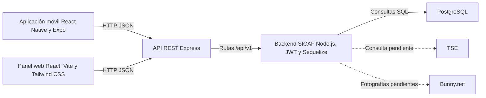

# Arquitectura de SICAF

## Componentes y comunicaciones

El [diagrama editable en FigJam](https://www.figma.com/board/JniN3acMMwkc28n4GDimNq) mantiene la misma vista de alto nivel.

## Comunicación local

| Componente | Dirección local | Comunicación saliente |
| --- | --- | --- |
| Panel web | `http://localhost:5173` | `VITE_API_URL=http://localhost:3000` |
| Aplicación en `SICAF_API_36` | Expo Go | `EXPO_PUBLIC_API_URL=http://10.0.2.2:3000` |
| Backend | `http://localhost:3000` | `DATABASE_URL` hacia PostgreSQL |
| PostgreSQL | `localhost:5432` | Solo recibe conexiones del backend |

`10.0.2.2` es la dirección utilizada por el emulador Android para acceder al equipo anfitrión. En un dispositivo físico se debe configurar la IP local del equipo que ejecuta la API.

## Responsabilidades

- La aplicación móvil implementa los procesos operativos de la garita y consume la API REST.
- El panel web implementa administración, consultas, aprobaciones y reportes, y consume la misma API REST.
- El backend centraliza autenticación, catálogos, movimientos, auditoría y sincronización.
- PostgreSQL es la fuente de datos central; los clientes no acceden directamente a la base.
- JWT protegerá las operaciones de la API cuando se implemente la autenticación del Entregable 3.

## Integraciones previstas

- TSE para consulta de identidad; contrato y acceso pendientes.
- Bunny.net para almacenamiento fotográfico; configuración pendiente.
- NFC y OCR en la aplicación móvil; implementación pendiente.
- WatermelonDB para persistencia y sincronización local; implementación pendiente.

Estas integraciones no se representan como funcionales hasta que se implementen en sus entregables correspondientes.

## Gestión de configuración

Cada repositorio incluye `.env.example` con valores de desarrollo y excluye `.env` de Git. Los secretos y credenciales reales deben suministrarse fuera del repositorio para cada entorno.
